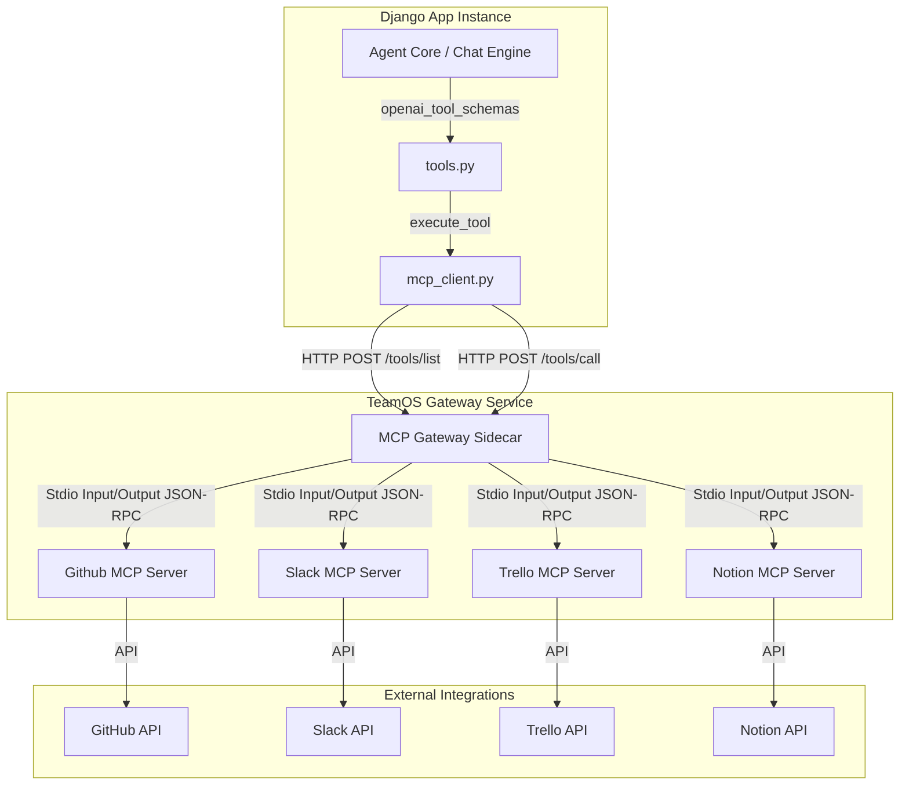
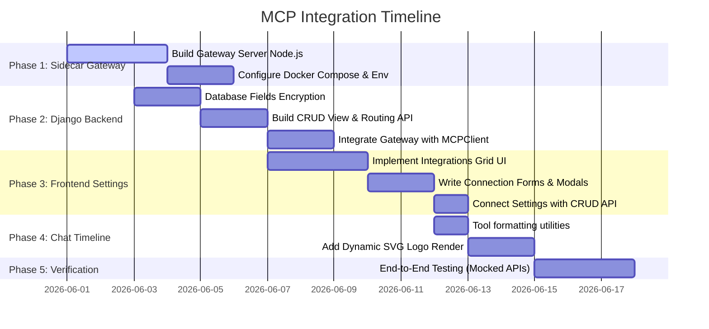

# TeamOS MCP Integration Plan: GitHub, Slack, Trello & Notion

This document provides a comprehensive, production-ready implementation plan to integrate the Model Context Protocol (MCP) into the TeamOS platform. It covers architectural considerations, secure credential storage, backend Django APIs, a dedicated Node.js MCP HTTP Gateway Sidecar, and a polished frontend settings panel.

---

## 1. System Architecture Analysis & Design

### Current State
* **Backend (`backend/chat/mcp_client.py`)**: 
  - Exists as a Django-level client wrapper (`MCPClient`) that queries external HTTP/SSE servers via POST requests to `/tools/list` and `/tools/call`.
  - Discovered tools are dynamically converted to OpenAI-compatible function schemas (prefixed with `mcp_{server_name}_{tool_name}`).
  - Routes execution of tool calls prefixed with `mcp_` transparently through `execute_tool()` in `backend/chat/tools.py`.
* **Database (`backend/chat/models.py`)**: 
  - Contains `MCPServerRegistration` with fields for `name`, `url`, `auth_token`, `capabilities`, and `enabled`.
* **Frontend (`frontend/src/app/(app)/settings/page.tsx`)**:
  - The "Integrations" and "API Keys" tabs display coming-soon placeholders.
  - The chat interface rendering pipeline (`ChatAgentToolTimeline.tsx`) renders raw tool names without service grouping or tailored iconography.

### Target Architecture
MCP servers (like the official ones for GitHub, Slack, etc.) are designed to run as Node.js/Python CLI processes using a `stdio` transport. Directly spawning Node processes from Django gunicorn workers creates significant reliability and performance concerns (resource exhaustion, orphan processes, blocking event loops). 

We will deploy a lightweight **MCP Gateway Sidecar** (Node.js/Express) that acts as an HTTP-to-Stdio bridge:



---

## 2. Backend Implementation Detail

### A. Database Enhancements (Secure Credentials Storage)
To prevent API tokens (GitHub PATs, Slack Bot Tokens, Notion Integration Keys) from being stored as plain text in `MCPServerRegistration.auth_token`, we will implement symmetrical encryption for the token fields using cryptography.

#### Proposed Changes to `backend/chat/models.py`:
```python
import base64
import os
from django.conf import settings
from cryptography.fernet import Fernet

def get_encryptor():
    # Use SECRET_KEY or a dedicated encryption key from environment
    key = settings.SECRET_KEY[:32].encode("utf-8")
    return Fernet(base64.urlsafe_b64encode(key))

class MCPServerRegistration(models.Model):
    # ... Existing fields ...
    # We will encrypt the auth_token field upon save
    
    def save(self, *args, **kwargs):
        if self.auth_token and not self.auth_token.startswith("enc::"):
            f = get_encryptor()
            encrypted = f.encrypt(self.auth_token.encode("utf-8")).decode("utf-8")
            self.auth_token = f"enc::{encrypted}"
        super().save(*args, **kwargs)

    @property
    def decrypted_token(self) -> str:
        if not self.auth_token:
            return ""
        if not self.auth_token.startswith("enc::"):
            return self.auth_token
        try:
            f = get_encryptor()
            encrypted_payload = self.auth_token[5:]  # strip 'enc::'
            return f.decrypt(encrypted_payload.encode("utf-8")).decode("utf-8")
        except Exception:
            return ""
```

### B. REST Endpoints for Integrations
Create CRUD endpoints in `backend/chat/views.py` and register them in `backend/chat/urls.py` so the frontend can query, configure, and toggle integrations.

#### Endpoints Matrix:
| Path | Method | Purpose | Payload |
|---|---|---|---|
| `/api/chat/<uuid:team_id>/mcp-servers/` | `GET` | List all registered integrations (hides encrypted auth tokens). | `[]` |
| `/api/chat/<uuid:team_id>/mcp-servers/` | `POST` | Register a new tool integration. | `{ "name": "github", "url": "...", "auth_token": "..." }` |
| `/api/chat/<uuid:team_id>/mcp-servers/<uuid:server_id>/` | `PATCH` | Toggle `enabled` state or update credentials. | `{ "enabled": false, "auth_token": "..." }` |
| `/api/chat/<uuid:team_id>/mcp-servers/<uuid:server_id>/` | `DELETE` | Remove the integration registration. | `None` |
| `/api/chat/<uuid:team_id>/mcp-servers/<uuid:server_id>/sync/` | `POST` | Force tool list refresh & invalidate Redis cache. | `None` |

---

## 3. Node.js MCP HTTP Gateway Sidecar

The sidecar runs as a separate Node.js service (configured via Docker Compose). It exposes HTTP endpoints mapping to individual stdio-based MCP servers.

### Directory Structure:
```
/teamos-mcp-gateway/
├── package.json
├── server.js
└── config.json
```

### Gateway Implementation (`server.js`):
```javascript
const express = require('express');
const { spawn } = require('child_process');
const readline = require('readline');
const app = express();
app.use(express.json());

const PORT = process.env.PORT || 9090;

// Managed subprocess dictionary: teamId_serverName -> ChildProcess
const activeProcesses = {};

function getOrStartServer(teamId, serverName, authToken) {
  const key = `${teamId}_${serverName}`;
  if (activeProcesses[key]) return activeProcesses[key];

  let command = 'npx';
  let args = [];
  let env = { ...process.env };

  switch (serverName) {
    case 'github':
      args = ['-y', '@modelcontextprotocol/server-github'];
      env.GITHUB_PERSONAL_ACCESS_TOKEN = authToken;
      break;
    case 'slack':
      args = ['-y', '@modelcontextprotocol/server-slack'];
      env.SLACK_BOT_TOKEN = authToken;
      break;
    case 'trello':
      args = ['-y', 'mcp-server-trello']; // npm package
      // Trello needs key & token passed in
      const [trelloKey, trelloToken] = authToken.split(':');
      env.TRELLO_API_KEY = trelloKey;
      env.TRELLO_TOKEN = trelloToken;
      break;
    case 'notion':
      args = ['-y', '@modelcontextprotocol/server-notion'];
      env.NOTION_API_KEY = authToken;
      break;
    default:
      throw new Error(`Unsupported MCP server name: ${serverName}`);
  }

  const child = spawn(command, args, { env });
  const rl = readline.createInterface({ input: child.stdout });

  const processRef = {
    child,
    rl,
    requestId: 1,
    pendingRequests: {},
  };

  rl.on('line', (line) => {
    try {
      const response = JSON.parse(line);
      const callback = processRef.pendingRequests[response.id];
      if (callback) {
        callback(response);
        delete processRef.pendingRequests[response.id];
      }
    } catch (e) {
      console.error('Failed to parse line from MCP server stdout:', e);
    }
  });

  child.stderr.on('data', (data) => {
    console.error(`[${serverName} STDERR]:`, data.toString());
  });

  activeProcesses[key] = processRef;
  return processRef;
}

// HTTP API Endpoint: List tools
app.post('/:serverName/tools/list', (req, res) => {
  const { serverName } = req.params;
  const teamId = req.headers['x-team-id'] || 'default';
  const authToken = req.headers['authorization']?.replace('Bearer ', '');

  try {
    const processRef = getOrStartServer(teamId, serverName, authToken);
    const id = processRef.requestId++;
    
    processRef.pendingRequests[id] = (response) => {
      if (response.error) {
        return res.status(500).json({ error: response.error });
      }
      res.json(response.result);
    };

    processRef.child.stdin.write(JSON.stringify({
      jsonrpc: '2.0',
      id,
      method: 'tools/list',
      params: {}
    }) + '\n');
  } catch (err) {
    res.status(400).json({ error: err.message });
  }
});

// HTTP API Endpoint: Call tool
app.post('/:serverName/tools/call', (req, res) => {
  const { serverName } = req.params;
  const teamId = req.headers['x-team-id'] || 'default';
  const authToken = req.headers['authorization']?.replace('Bearer ', '');
  const { params } = req.body;

  try {
    const processRef = getOrStartServer(teamId, serverName, authToken);
    const id = processRef.requestId++;

    processRef.pendingRequests[id] = (response) => {
      if (response.error) {
        return res.status(500).json({ error: response.error });
      }
      res.json(response.result);
    };

    processRef.child.stdin.write(JSON.stringify({
      jsonrpc: '2.0',
      id,
      method: 'tools/call',
      params: {
        name: params.name,
        arguments: params.arguments,
      }
    }) + '\n');
  } catch (err) {
    res.status(400).json({ error: err.message });
  }
});

app.listen(PORT, () => {
  console.log(`TeamOS MCP Sidecar running on port ${PORT}`);
});
```

---

## 4. Frontend Integration & UI Redesign

We will implement a polished settings section inside `frontend/src/app/(app)/settings/page.tsx` that coordinates with the backend API.

### A. Settings Tab Interface Refactor
Update `activeTab === "integrations"` to render a grid of available integrations with beautiful icons, connection statuses, and credential configuration modals.

```typescript
// Proposed structure for integrations
interface MCPIntegration {
  name: string;
  displayName: string;
  description: string;
  icon: React.ComponentType;
  fields: { key: string; label: string; placeholder: string; isSecret: boolean }[];
}

const MCP_INTEGRATION_TEMPLATES: MCPIntegration[] = [
  {
    name: "github",
    displayName: "GitHub",
    description: "Search issues, create PRs, read repositories, and manage commits directly from chat.",
    icon: GithubIcon,
    fields: [
      { key: "token", label: "Personal Access Token", placeholder: "ghp_...", isSecret: true }
    ]
  },
  {
    name: "slack",
    displayName: "Slack",
    description: "Send status reports, read channel context, and ping team members in real-time.",
    icon: MessageSquareIcon,
    fields: [
      { key: "token", label: "Bot User OAuth Token", placeholder: "xoxb-...", isSecret: true }
    ]
  },
  {
    name: "trello",
    displayName: "Trello",
    description: "Manage cards, move cards through statuses, list boards, and create project tasks.",
    icon: ColumnsIcon,
    fields: [
      { key: "token", label: "API Key : User Token (colon separated)", placeholder: "key:token", isSecret: true }
    ]
  },
  {
    name: "notion",
    displayName: "Notion Workspace",
    description: "Read wikis, append notes, query databases, and synchronize requirements documentation.",
    icon: BookOpenIcon,
    fields: [
      { key: "token", label: "Internal Integration Secret", placeholder: "secret_...", isSecret: true }
    ]
  }
];
```

#### Key UI Interactions:
1. **Status Badge**: If integrated, display a green `Connected` pill with a button to `Sync Tools` or `Disconnect`. If not integrated, show `Not Configured` in muted text with a `Configure` button.
2. **Interactive Form Modal**: Displays input fields, hides credentials by default, and features a `Test Connection` button which performs an test `/tools/list` API check to verify validity.
3. **Smooth Toggle**: Instant enabling/disabling via database updates without losing saved secrets.

### B. Chat Tool Timeline Visualization
To maintain visual excellence (Zen Mode aesthetic) and minimize cognitive load in the chat tool timeline (`ChatAgentToolTimeline.tsx`), we will format tool runs dynamically:

```typescript
// Helper to transform tool execution status
export function getFriendlyMCPName(rawName: string) {
  if (!rawName.startsWith("mcp_")) return { name: rawName, logo: null };
  const parts = rawName.split("_");
  const server = parts[1]; // 'github', 'slack', 'trello', 'notion'
  const action = parts.slice(2).join(" ").replace(/_/g, " ");
  
  return {
    name: `${server.charAt(0).toUpperCase() + server.slice(1)}: ${action}`,
    server
  };
}
```

We will display platform-specific icons (GitHub, Slack, Trello, Notion logo SVG) next to each step.

---

## 5. Detailed Step-by-Step Implementation Roadmap



### Phase 1: Sidecar Gateway Setup
1. Create `/backend/mcp_gateway/` folder.
2. Initialize `package.json` with `@modelcontextprotocol/sdk`, `express`, `dotenv`, and standard CLI helpers.
3. Build the Node.js runner process that dynamically executes command strings and maps environment arguments.

### Phase 2: Django Backend & Security
1. Write a custom wrapper in `backend/chat/models.py` to encrypt/decrypt sensitive string tokens dynamically on model persistence.
2. Add API endpoint definitions and test endpoints for connections.
3. Replace hardcoded endpoints in `mcp_client.py` to target the internal Docker-Compose network service `http://mcp-gateway:9090/{name}/tools/list`.

### Phase 3: Settings Panel UI Design
1. Refactor `frontend/src/app/(app)/settings/page.tsx`'s integrations rendering.
2. Ensure consistent typography (DM Sans + Instrument Serif fonts) and color mapping consistent with Zen UI guidelines.
3. Connect UI components directly to the newly exposed team API routes.

### Phase 4: Chat Visual Polish
1. Refactor `ChatAgentToolTimeline.tsx` to handle `mcp_` prefixes using custom SVG renderers for integrated icons.
2. Trim noisy logs/inputs to display compact status text (e.g. `Slack: send message`).

### Phase 5: E2E Verification
1. Register Slack & GitHub developer apps.
2. Feed credentials in TeamOS Sandbox.
3. Engage TeamOS agents in chat instructions: *"Create an issue in our GitHub repository summarizing this chat session."* or *"Notify the Slack channel with the current project status report."* and verify tool-chains stream live status updates correctly.

---
*Implementation Plan Prepared for TeamOS Core Integration. 2026.*
