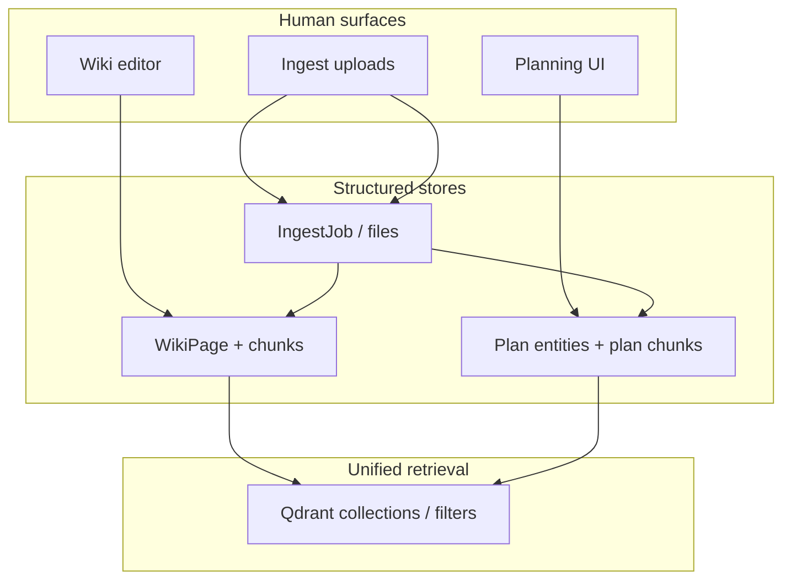

# TeamOS — Project Planning: Full Preparation Deck

> **Purpose:** A deep, implementation-agnostic specification for introducing **team project planning** as a **separate product surface** that remains **tightly coupled** to the wiki, ingest/embedding stack, chat agent, payments, and owner-led user management.  
> **Audience:** You (analysis) and future implementers.  
> **Constraint:** This document describes *what* to build and *why*; it does **not** prescribe code changes.

---

## 1. Executive summary

**Project planning** in TeamOS should be:

1. **A distinct module** — Its own mental model (plans, milestones, workstreams, decisions), not a buried subsection of the wiki or ingest UI.
2. **Agent-addressable** — The same “wiki agent” philosophy extends here: the agent must **read** canonical plan state and **act** on it (create/update tasks, link evidence, propose wiki updates) within role and plan limits.
3. **Wiki-native at the edges** — Plans **reference** wiki pages (`[[slug]]` or stable IDs), can **spawn** wiki pages (briefs, ADRs, meeting notes), and **share** the embedding/search path so chat remains one coherent “ask the team brain” experience.
4. **Simple in the UI** — Rich capabilities live behind **progressive disclosure**: default views stay calm; power tools (dependencies, capacity, scenarios) appear on demand.
5. **Governed like the rest of the product** — **Team plan** (free / team / pro / enterprise) and **role** (owner / editor / viewer) gate who can plan, who can let the agent mutate plans, and how much retrieval/embedding capacity planning consumes.

This deck ties together: **new app route + sidebar**, **chat mode `Plan` alongside `Ask` and `Wiki agent`**, **backend app boundary**, **ingest + embeddings + wiki graph relations**, and **owner/billing alignment**.

---

## 2. Current baseline (repo facts)

Use this as the anchor so the planning module does not fight the existing architecture.

| Area | Today (relevant facts) |
|------|-------------------------|
| **Sidebar** | `NAV_ITEMS` in `frontend/src/components/sidebar/Sidebar.tsx`: Wiki, Graph, Chat, Ingest, Analytics — **no Planning route yet**. |
| **Chat modes** | `ChatModeSelect.tsx`: `ChatMode = "ask" \| "agent"` — **Ask** vs **Wiki agent**; agent requires `can_edit_wiki` + `agent_mode_available`. |
| **Wiki** | `WikiPage` with `page_type` (standard, decision, meeting, brief, incident, sop), `frontmatter` JSON, `PageChunk` + Qdrant via ingest pipeline. |
| **Ingest** | `ingest/pipeline.py`: chunking tiered by `team.plan`, embeddings, governance hooks vs existing wiki. |
| **Teams** | `Team.plan`, `TeamMember.role` (owner / editor / viewer); owner-only operations for settings, billing-adjacent team updates. |
| **Product vision doc** | `TEAMOS_PLAN.md` explicitly **cut** kanban from v1 — planning should be framed as **structured execution memory**, not a generic PM clone, unless you consciously expand scope. |

Anything you add should **extend** these patterns (capabilities API, team scoping, Qdrant payloads) rather than invent a parallel auth or vector store.

---

## 3. Conceptual model: planning vs wiki vs ingest

### 3.1 Three layers of “truth”

- **Wiki** = narrative, long-lived knowledge, interlinked pages.  
- **Planning** = **time-ordered and obligation-oriented** state: what we committed to, by when, with what status — still **team-scoped** and **durable**.  
- **Ingest** = **bring external truth in**; output should be able to land in **either** wiki pages **or** plan items (or both), with provenance.

### 3.2 Why “separate thing” still matters

If planning is only markdown in the wiki, you lose:

- Fast **cross-plan** queries (all overdue items for a team).
- **Agent tools** that are smaller than “edit whole page” (patch one milestone).
- Clear **UX** for non-writers (viewers) who must see a roadmap without opening the editor.

If planning is a **siloed SaaS**, you lose:

- **One chat** over wiki + plans + ingested docs.
- **Wikilinks** and **graph** coherence.

**Resolution:** Separate **navigation page** and **domain model** (likely a Django app `planning` or `projects`), but **shared infrastructure** (team, auth, vectors, citation style, design system).

---

## 4. Product surface: frontend

### 4.1 New route and sidebar

- **Route:** e.g. `/plan` or `/planning` (pick one canonical path; `/plan` is short for the sidebar).
- **Sidebar:** Add a nav item **between** areas that match user mental flow, e.g. after **Wiki** and before **Graph** (knowledge → commitments → relationships), or after **Chat** if you want “work” grouped together. The important part is **one primary entry**, not multiple ambiguous entries.
- **Collapsible rail:** Reuse the same iconography density and tokens as existing nav (`lucide-react`, same hover/active patterns).

### 4.2 Planning page IA (simple default, rich optional)

**Default landing (calm):**

- **Current cycle** — e.g. “This week” / active milestone name (single line).
- **My work** — assigned to me (even for editors; owners see team toggle).
- **Recent changes** — human-readable activity, not a raw audit log.

**Secondary (tabs or left sub-nav within `/plan`, not new top-level routes):**

- **Roadmap** — timeline / phases (zoom levels: quarter → sprint).
- **Backlog** — unprioritized items (collapsible).
- **Decisions** — links to wiki `page_type=decision` or embedded decision blocks.
- **Resources** — links to wiki, ingested docs, external URLs (all as typed links).

**Power tools (drawers or modals):**

- Dependencies graph (subset of main Graph or lightweight DAG).
- Capacity / estimates (if you add them later).
- **Templates** (“New initiative from template”) — mirror `PageTemplate` thinking.

This satisfies **“richer planning tools but not messy”**: the **shell** stays minimal; depth is **one click** away.

### 4.3 Alignment with existing frontend patterns

- **Team context:** Same `currentTeamId` / team switcher as wiki — no second team selector on the planning page.
- **Auth-gated UI:** Mirror chat capabilities pattern — fetch a **`/api/.../capabilities/`**-style payload that includes `can_edit_plans`, `can_use_plan_agent`, `plan_module_enabled` (see §7).
- **Visual language:** Same surfaces (`--surface-1`, borders, rounded-xl controls) as `ChatModeSelect` and sidebar — planning should feel like **TeamOS**, not a bolt-on iframe.

### 4.4 Chat: third mode — **Plan**

Extend the mental model:

| Mode | User intent | System behavior (high level) |
|------|-------------|------------------------------|
| **Ask** | Understand / find | Read-only RAG; citations to wiki **and** plan chunks **and** ingested embeddings. |
| **Wiki agent** | Mutate narrative knowledge | Tools: create/update wiki pages (existing). |
| **Plan** | Mutate commitments & structure | Tools: create/update milestones, tasks, links to wiki pages, status transitions — **scoped** and **idempotent** where possible. |

**UI:** `ChatModeSelect` becomes a three-way control (or segmented control): **Ask** | **Plan** | **Wiki agent** (order can be Ask → Plan → Wiki agent so “read → plan work → change docs” reads left-to-right).

**Copy / tooltips:** Each mode needs a **one-sentence** promise and a **constraint** (e.g. “Plan mode can change roadmap items for this team; it cannot change billing.”).

**Optional:** When the user is on `/plan`, default chat mode to **Plan**; on `/wiki`, default to **Ask** or last-used. Reduces mode errors without extra chrome.

---

## 5. Backend: separate app, integrated spine

### 5.1 Recommendation: **`planning` Django app** (not a microservice)

**Why a separate app inside the same backend repo:**

- Clear **URL namespace** (`/api/planning/...`), migrations, admin, tests.
- Shares **Team**, **User**, **authentication**, Celery, settings, `PLAN_TIERS`.
- Single deployment unit — no distributed transaction pain for “create task + link wiki page”.

**When a separate microservice would be justified:** Multiple teams consuming planning APIs, different scaling profile, or regulatory isolation. That is **not** implied by your requirements today.

### 5.2 Core domain entities (conceptual — not a schema mandate)

Design for **normalized** plan state the agent can patch:

- **Initiative / Project** — top container (name, goal, status, dates, owner membership).
- **Milestone** — dated checkpoint; belongs to initiative.
- **Work item / Task** — assignee (`TeamMember` or external email placeholder), status, priority, optional estimate.
- **PlanLink** — typed link to `WikiPage`, `IngestJob` output, or external URL; stores display title + resolved id.
- **PlanEvent / Activity** — append-only audit for “agent moved task X to done” vs “Jane edited dates”.

**Versioning:** Either optimistic locking (`updated_at` + If-Match) or event-sourcing-lite via `PlanEvent`. Pick one before UI promises “no lost updates.”

### 5.3 Service layer the agent must call

Expose **internal Python services** (not only REST) for:

- `get_plan_context(team_id, initiative_id?)` — compact JSON for LLM system prompt.
- `apply_plan_tool(team_id, user_id, tool_call)` — validates role + plan tier + idempotency keys.

REST/DRF endpoints for the React app should **delegate** to the same services the WebSocket/chat agent uses — **no divergent business rules**.

### 5.4 “Richer planning tools” as **capabilities**, not **screens**

Implement advanced behaviors as **server-side features** toggled by plan tier:

| Capability | Free | Team | Pro |
|------------|------|------|-----|
| Max initiatives | low | medium | high |
| Agent plan mutations / month | 0 or read-only | limited | higher |
| Cross-initiative portfolio view | no | yes | yes |
| Dependency DAG | no | simple | full |
| Automated roll-up to wiki “status page” | no | optional cron | yes |

The **UI** exposes one **Portfolio** toggle; the backend enforces limits. Avoid showing disabled controls without explanation — use **upgrade hint** copy tied to `Team.plan` (same pattern as billing elsewhere).

---

## 6. Agent behavior: must act on planning + use wiki

### 6.1 Agent contracts

**Plan mode agent:**

1. **Retrieve** — Hybrid search over `PageChunk` + **plan-specific chunks** (see §8) + optional structured fields injected as **system context** (active milestones JSON).
2. **Reason** — Respect **team conventions** from wiki (e.g. definition of done in a `[[glossary]]` page).
3. **Act** — Call **allowed tools only** (see §6.2); never bypass Django ORM or raw SQL from the model.
4. **Cite** — Every factual claim should prefer **citations** to wiki or plan artifacts (reuse citational chat patterns).

**Wiki agent (existing) when planning exists:**

- Should **see** that certain wiki pages are **linked from plans** (boost in retrieval or explicit “pinned context” section in prompt).
- May propose **new wiki pages** for decisions that currently sit only as tasks (lifecycle hygiene).

### 6.2 Tool design (minimal, composable)

Prefer **few tools with clear JSON schemas** over dozens of buttons:

| Tool | Purpose |
|------|---------|
| `plan_search` | Semantic + filter search across initiatives/tasks (and optionally wiki in one call or separate `wiki_search` for clarity). |
| `plan_item_upsert` | Create or update task/milestone with stable client id for idempotency. |
| `plan_item_status` | Valid transitions only (state machine). |
| `plan_link_wiki` | Attach/detach `WikiPage` to an item or initiative. |
| `wiki_read` / `wiki_write` | Reuse existing wiki tools where **Plan** mode is allowed to touch narrative (policy: optional; strict teams might disable wiki writes from Plan mode). |

**Role matrix (conceptual):**

- **Viewer:** no mutate tools; Ask mode only for plans.
- **Editor:** mutate plan items; optionally wiki write from Wiki agent only.
- **Owner:** same as editor for planning content; **plus** team settings / billing — but **never** expose billing tools to **any** chat agent by default.

### 6.3 Manual + chat + agent coexistence

- **Manual:** Planning UI is the **source of truth** for structure; drag-drop, forms, keyboard shortcuts.
- **Chat (Plan mode):** Natural language → **tool calls** → same persistence as manual edits → **activity log** shows “via chat by user X.”
- **Agent autonomy:** Same as wiki agent — **user-initiated** turns; optional **async jobs** (e.g. “digest my inbox into tasks”) as a **later** phase with explicit job UI.

---

## 7. Payments, plans, and owner-led user management

### 7.1 Hand-in-hand with existing team model

- **`Team.plan`** already drives chunking and model access in ingest; **extend** `PLAN_TIERS` (or parallel `PLANNING_LIMITS`) for planning-specific quotas.
- **Owner** retains: enabling/disabling planning for the team (feature flag), upgrading plan, inviting members, role changes.
- **Editors** do the day-to-day planning; **viewers** see roadmaps and can Ask the chat about plans.

### 7.2 Commercial clarity

- Decide whether **planning is** a **Team+** feature or **included in Free** with tight limits (common: free has read-only portfolio, paid unlocks agent + integrations).
- Surface **one** upgrade CTA path (reuse `HomePricing` / checkout helpers philosophy — `billingCheckout.ts` patterns).

### 7.3 Audit and trust

Owners care about **who changed commitments**. Reuse or extend `KnowledgeActivity`-style logging for **plan mutations** (user id, source: ui | api | agent, diff summary).

---

## 8. Ingest, embedding, and wiki relations

### 8.1 Planning content must be **ingestable**

Two complementary paths:

1. **Structured ingest** — CSV / JSON / Jira export → mapped to `Initiative` / `Task` via Celery job (like `IngestJob` but different mapper).  
2. **Narrative ingest** — A PRD PDF becomes **both** a wiki page (already supported by pipeline patterns) **and** optional extracted **tasks** if you add an LLM extraction stage (strict human review queue for v1 is wise).

### 8.2 Embeddings for plans

Mirror `PageChunk`:

- **`PlanChunk`** (or generic `EmbeddingRecord` with `source_type=wiki|plan|ingest`) with `qdrant_point_id`, `content_hash`, `team_id`.
- **Payload** in Qdrant should include: `team_id`, `source_type`, `title`, `snippet`, `initiative_id`, `task_id`, `wiki_page_id` (nullable), `visibility` (inherit team).

**Why not only embed wiki?**  
Structured fields (dates, assignees) **do not embed well** if only stored as prose. Dual representation:

- **Canonical:** relational DB fields for filters and agent tools.  
- **Search:** render a **canonical text projection** per task (“Task: X | Status: done | Due: … | Links: [[foo]]”) and chunk that for retrieval — keeps chat **searchable** without abandoning structure.

### 8.3 Wiki forming relations with ingested + plan data

- **Wikilinks in plan descriptions** — Parse `[[...]]` on save; maintain **edges** compatible with your **Graph** module (same edge table or a `relation_type=plan_wiki` edge).
- **Ingested wiki pages** — Already create/update `WikiPage` + chunks; planning items should **reference** those page IDs so the graph shows **plan ↔ evidence doc** connectivity.
- **“Status rollup” wiki page** — Optional generated markdown page (owner opt-in) that reflects current milestones; regenerated on significant plan changes — makes **wiki the readable digest** while **plan DB stays authoritative**.

---

## 9. Chat search: one retrieval pipeline

### 9.1 Unified Ask mode

For **Ask**, retrieval should **merge**:

1. Wiki chunks (existing).  
2. Plan chunks (canonical projection).  
3. Ingest-only chunks (if not already promoted to wiki — policy choice).

Use **reciprocal rank fusion** or weighted scores; boost when user query contains temporal intent (“deadline”, “Q2”, “overdue”).

### 9.2 Citations

Citation cards should show **type**: Wiki | Plan | File (ingest), with deep links:

- Wiki → `/wiki?page=...`  
- Plan → `/plan?initiative=...&task=...`  
- File → `/ingest` job or stored preview URL

### 9.3 Agent modes

- **Wiki agent** — wiki tools + read plan context (recommended) so it does not contradict commitments.  
- **Plan agent** — plan tools + read wiki (required per your spec).

---

## 10. Information architecture checklist

| Requirement | Preparation answer |
|-------------|----------------------|
| Separate from ingest/chat | **Yes** — dedicated `/plan` + `planning` app; ingest remains “bring data in”; chat remains “converse”; planning is “commit and track.” |
| Sidebar | **Add** single nav entry. |
| Chat modes | **Add `Plan`** beside **Ask** and **Wiki agent**; extend capabilities API. |
| Not cluttered | **Progressive disclosure**; one primary planning view; power in tabs/drawers. |
| Backend | **Separate Django app**, shared DB and vector stack. |
| Owner + payment | **Plan tier limits** + owner toggles; audit log; upgrade paths. |
| Ingestable | **Jobs + mappers** for structured imports; narrative path via existing wiki pipeline + optional task extraction. |
| Embedded + searchable | **PlanChunk** / unified vector payload; canonical text projection. |
| Wiki relations | **PlanLink** + wikilinks + graph edges + optional rollup page. |

---

## 11. Phased delivery roadmap (suggested)

**Phase A — Skeleton (trust + navigation)**  
Route, sidebar, empty state, RBAC placeholders, read-only mock data.

**Phase B — Core model + UI**  
Initiatives, milestones, tasks, assignments, manual CRUD, activity feed.

**Phase C — Embeddings + Ask**  
Plan chunking, Qdrant indexing, merge retrieval in Ask mode, citations.

**Phase D — Plan chat agent**  
Tool definitions, idempotency, rate limits by `Team.plan`, evaluation harness.

**Phase E — Ingest + graph**  
Import mappers, wiki linking, graph edges, optional rollup wiki page.

**Phase F — Polish + enterprise**  
SSO hooks if needed, export, portfolio across many initiatives.

Each phase should have **acceptance tests** named from user stories (“Viewer cannot call plan_upsert”, “Ask cites a task due next week”).

---

## 12. Risks and decisions to lock before implementation

1. **Scope vs `TEAMOS_PLAN.md` “no kanban”** — Either redefine planning as **lightweight** (milestones + tasks) or explicitly expand product scope to full PM; mixing without a decision yields infinite UI creep.  
2. **Single vs dual agent** — One agent with mode flag vs two specialized system prompts; affects evals and caching.  
3. **Wiki write from Plan mode** — Allowed, forbidden, or owner-configurable? Default **forbidden** is safest.  
4. **Source of truth conflicts** — If wiki says “ship June” but plan says “July,” retrieval must surface **both** and agent policy must prefer **plan for dates** and **wiki for rationale** (document the hierarchy).  
5. **Multi-workspace / enterprise** — If `Team` is not the only boundary later, plan IDs must not be globally ambiguous in vectors (always filter `team_id`).

---

## 13. Glossary

| Term | Meaning in this deck |
|------|------------------------|
| **Planning module** | User-facing `/plan` + backend `planning` app + vectors + chat integration. |
| **Canonical projection** | A deterministic string rendering of structured plan rows for embedding. |
| **Plan mode** | Chat mode whose tools mutate planning entities. |
| **Unified retrieval** | One search path combining wiki, plan, and ingest chunks for Ask. |

---

## 14. Document control

| Version | Date | Notes |
|---------|------|-------|
| 1.0 | 2026-05-02 | Initial preparation deck; analysis only, no implementation. |

---

*End of preparation deck. Implement nothing until you have reviewed and adjusted scope, RBAC, and phase order.*
